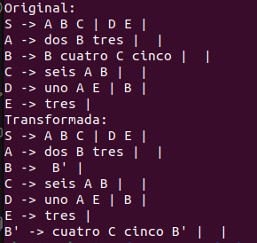
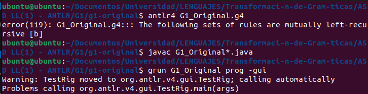
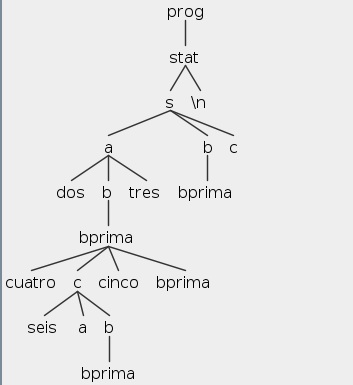
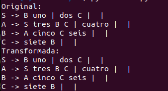
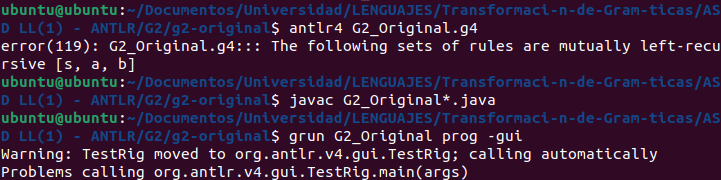
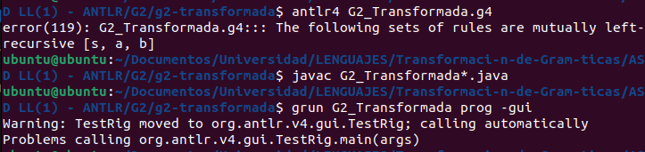
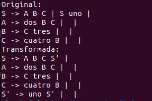
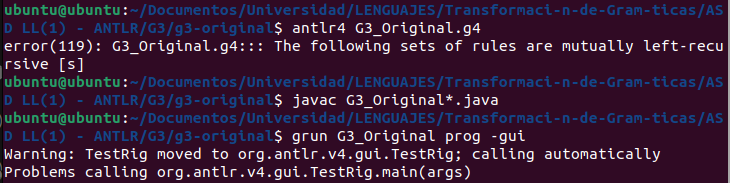
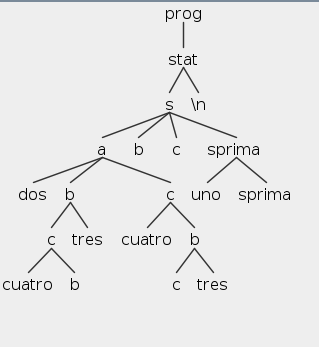

# Transformación de Gramáticas

Este repositorio contiene distintas gramáticas y sus respectivas transformación haciendo uso de la eliminación de recursividad por la izquierda y factorización. 

## Cómo usar

**Requisitos:** Para ejecutar este proyecto se debe tener instalado Python3, Antlr v4.13 y Java Development Kit (JDK) versión 22 o superior.

1. Clonar el repositorio con `git clone https://github.com/whocar3s/Transformaci-n-de-Gram-ticas.git`

2. Desde la consola acceder a la ruta donde se clono el proyecto y entrar a la carpeta en la cual se desee probar:

    - Para probar la gramática 1: `cd G1`
    - Para probar la gramática 2: `cd G2`
    - Para probar la gramática 3: `cd G3`

    2.1 Para observar la transformación de la gramática en consola `python3 nombredelarchivo.py` (el archivo puede ser `G1.py`, `G2.py` o `G3.py` dependiendo de la carpeta )

    2.2 Para observar el arbol de cada gramática entrar a la carpeta de la que se desee observar, teniendo en cuenta la carpeta actual en la que se encuentre (G1, G2 o G3) :

    - Para probar la gramática 1 original: `cd g1-original`
    - Para probar la gramática 1 transformada: `cd g1-transformada`
    - Para probar la gramática 2 original: `cd g2-original`
    - Para probar la gramática 2 transformada: `cd g2-transformada`
    - Para probar la gramática 3 original: `cd g3-original`
    - Para probar la gramática 3 transformada: `cd g3-tramsformada`

    2.3. Compilar el proyecto con el comando `antlr4 nombredelarchivo.g4`

    2.4. Compilar los archivos Java generados`javac  nombredelarchivo*.java`

    2.5 Ejecutar para visualizar el árbol de análisis sintáctico:`grun nombredelarchivo prog -gui`

## Gramática 1:
```
S → A B C
S → B E
A → dos B tres
A → ɛ
B → B cuatro C cinco
B → ɛ
C → seis A B
C → ɛ
D → uno A E
D → B
E → tres
```
Esta gramática solo cuenta con recursión por la izquierda en esta regla `B → B cuatro C cinco`
- Transformación de la gramática en consola:
    
- Arboles:
    - Gramática original:
    
    - Gramática transformada:

        Cadena: `dos cuatro seis cinco tres`

        

## Gramática 2:
```
S → B uno
S → dos C
S → ɛ
A → S tres B C
A → cuatro
A → ɛ
B → A cinco C seis
B → ɛ
C → siete B
C → ɛ
```
Esta gramática no cuenta con recursión por la izquierda, ni con factores comunes por la izquierda de forma directa
- Transformación de la gramática en consola:
    
- Arboles:
    - Gramática original:
    
    - Gramática transformada:

        

No se observa ninguna modificación en la gramática debido a la complejidad de esta, ya que es demasiado compleja o contiene casos especiales que dificultan la eliminación de la recursión a la izquierda de manera automatizada, por la presencia de múltiples reglas recursivas y/o a la estructura particular de la gramática. 

## Gramática 3:
```
S → A B C
S → S uno
A → dos B C
A → ɛ
B → C tres
B → ɛ
C → cuatro B
C → ɛ
```
Esta gramática solo cuenta con recursión por la izquierda en esta regla `S → S uno`
- Transformación de la gramática en consola:
    
- Arboles:
    - Gramática original:
    
    - Gramática transformada:

        Cadena: `dos cuatro tres cuatro tres uno`

        

## Miembros del grupo

- Laura González
- Camilo Madero
- Paula Páez
- Felipe Rodriguez
